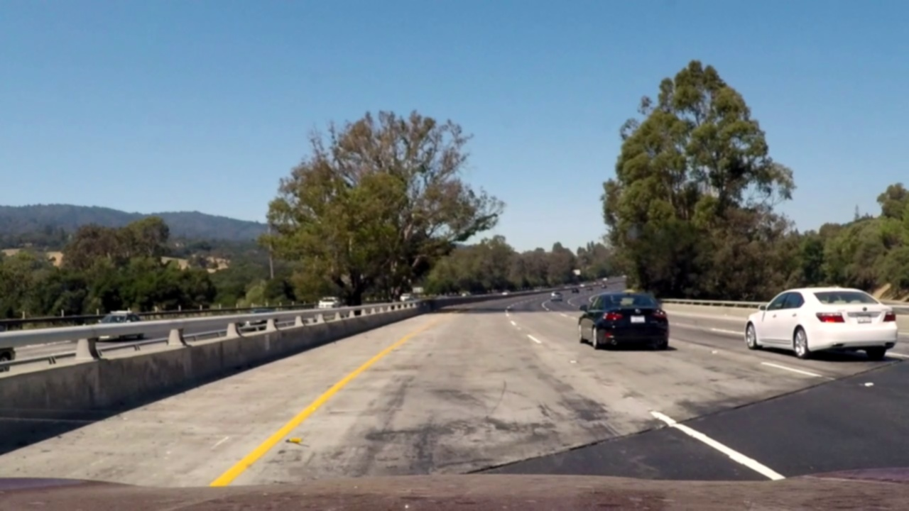

# **Finding Lane Lines on the Road** 

## Writeup Template

### You can use this file as a template for your writeup if you want to submit it as a markdown file. But feel free to use some other method and submit a pdf if you prefer.

---

**Finding Lane Lines on the Road**

The goals / steps of this project are the following:
* Make a pipeline that finds lane lines on the road
* Reflect on your work in a written report


---

### Reflection

### 1. Describe your pipeline. As part of the description, explain how you modified the draw_lines() function.

The pipeline mainly contains the following steps:

##### **smooth the color image, remove noisy**
```python
kernel_size = 5
image = cv2.GaussianBlur(image, (kernel_size, kernel_size),0)
```


##### **convert to hsv color space, and chose appropriate hsv ranges**

```python
hsv = cv2.cvtColor(image, cv2.COLOR_RGB2HSV)

# white color section in HSV space:[(h_min, h_mAX), (s_min, s_max), (v_min, v_max)]
hsv_write_threshold = [(0, 180), (0, 30), (150, 255)]

# select white region
white_thresholds = ((hsv[:,:,0] >= hsv_write_threshold[0][0]) & (hsv[:,:,0] <= hsv_write_threshold[0][1])) & \
        ((hsv[:,:,1] >= hsv_write_threshold[1][0]) & (hsv[:,:,1] <= hsv_write_threshold[1][1])) & \
        ((hsv[:,:,2] >= hsv_write_threshold[2][0]) & (hsv[:,:,2] <= hsv_write_threshold[2][1]))

# yello color section in HSV space
hsv_yellow_threshold = [(90, 100), (43, 255), (46, 255)]
yellow_thresholds = ((hsv[:,:,0] >= hsv_yellow_threshold[0][0]) & (hsv[:,:,0] <= hsv_yellow_threshold[0][1])) & \
        ((hsv[:,:,1] >= hsv_yellow_threshold[1][0]) & (hsv[:,:,1] <= hsv_yellow_threshold[1][1])) & \
        ((hsv[:,:,2] >= hsv_yellow_threshold[2][0]) & (hsv[:,:,2] <= hsv_yellow_threshold[2][1]))
```
hsv color image:


yellow and white region:

##### **set the lane line limitation region**
```python
h, w = image.shape[:2]

# use two triangle to devide lane-line area and none-lane-line area
polygon_1 = np.array([[(w*0.5, h*0.5), (w*0.1, h), (w*0.99, h-1)]], dtype=np.int32)
region_thresholds = np.zeros(image[:,:,0].shape, dtype=np.uint8)
polygon_2 = np.array([[(w*0.5, h*0.75), (w*0.3, h-1), (w*0.8, h-1)]], dtype=np.int32)
cv2.fillPoly(region_thresholds, polygon_1, 255)
cv2.fillPoly(region_thresholds, polygon_2, 0)
```


##### **run Canny and Hough in color selected region**
```python
thresholds = yellow_thresholds | white_thresholds   
region = np.zeros(image.shape[:,:,0], dtype=np.uint8)
region[thresholds] = 255

# Define our parameters for Canny and apply
low_threshold = 50
high_threshold = 150
edges = cv2.Canny(region, low_threshold, high_threshold)

# Define the Hough transform parameters
# Make a blank the same size as our image to draw on
rho = 1 # distance resolution in pixels of the Hough annotatedgrid
theta = np.pi/90 # angular resolution in radians of the Hough grid
threshold = 30     # minimum number of votes (intersections in Hough grid cell)
min_line_length = 1 #minimum number of pixels making up a line

# lane line width is nearly 20 pixels
max_line_gap = 20    # maximum gap in pixels between connectable line segments

# Run Hough on edge detected image
# Output "lines" is an array containing endpoints of detected line segments
lines = cv2.HoughLinesP(edges, rho, theta, threshold, np.array([]), min_line_length, max_line_gap)

# left lane line angle is in [10, 60]
# right lane line angle is in [-60, -10]
left_lines = []
right_lines = []
line_image = np.zeros(image.shape[:2], dtype=np.uint8) # creating a blank to draw lines on
if lines is not None:
    for line in lines:
        for x1,y1,x2,y2 in line:
            dy = y2 - y1
            dx = x2 - x1

            # cx, xy is the middle of the line
            cx = (x1 + x2) / 2
            cy = (y1 + y2) / 2
            # line end point must in selected region
            # cx < w / 2 means the line is on the left.
            if ( ( (cx < w/2) and (-60 < (np.arctan2(dy, dx) * 180.0 / 2 / np.pi) < -10)) \
                or (cx >= w/2) and (10 < (np.arctan2(dy, dx) * 180 / 2 / np.pi) < 60)\
                )\
                and region_thresholds[y1, x1] and region_thresholds[y2, x2]:
                if dx*dy > 0:
                    right_lines.append((x1, y1, x2, y2))
                else:
                    left_lines.append((x1, y1, x2, y2))
                # for debug
                cv2.line(line_image,(x1,y1),(x2,y2),255,1)
            else:
                pass
```
all lines found in yellow and white select images:


after region select:

##### ** fit the lines with LMS method. **

```python
# creating a blank to draw fit lines on.
# there will be more wanted points after draw lines.
fit_line_image = np.zeros(image.shape[:2], dtype=np.uint8) 
for x1, y1, x2, y2 in right_lines:
    cv2.line(fit_line_image,(x1,y1),(x2,y2),255,1)

points = np.where(fit_line_image>0)
if len(points[0]) < 2:
    # not enough line to polyfit. create a "outside" line.
    points = [(-1, -1), (1,2)]
try:
    # the fitted line formular is x = y*a + b
    right_fit_line= np.polyfit(points[0],points[1],1)
except Exception, ex:
    print ex, points

fit_line_image = np.zeros(image.shape[:2], dtype=np.uint8) # creating a blank to draw lines on
for x1, y1, x2, y2 in left_lines:
    cv2.line(fit_line_image,(x1,y1),(x2,y2), 255,2)
points = np.where(fit_line_image>0)
if len(points) < 2:
    points = [(-1, -1), (1,2)]
left_fit_line= np.polyfit(points[0], points[1],1)
if debug:
    print "\tright fit line: y = %f x + %f" % (right_fit_line[0], right_fit_line[1])
    print "\tleft fit line : y = %f x + %f" % (left_fit_line[0], left_fit_line[1])

fit_line_image = np.zeros(image.shape, dtype=np.uint8) # creating a blank to draw lines on

# the fomular is x = a*y + b. y is in [0.6h h].
cv2.line(fit_line_image, (int(right_fit_line[0]*h*0.6 + right_fit_line[1]), int(h*0.6)), (int(right_fit_line[0]*h + right_fit_line[1]), h), (0, 0, 255), 10)
cv2.line(fit_line_image, (int(left_fit_line[0]*h*0.6 + left_fit_line[1]), int(h*0.6)), (int(left_fit_line[0]*h + left_fit_line[1]), h), (0, 0, 255), 10)

output_image = cv2.addWeighted(image, 0.8, fit_line_image, 1, 0)

```
output image :


### 2. Identify potential shortcomings with your current pipeline

1. White and yellow region not works well all the time.
2. Region select maybe cut the right lane line.
3. Algorithm may not works find with another camera.


### 3. Suggest possible improvements to your pipeline
1. Before line polifitting, there will be another method to drop bad lines.
2. Algorithm can use the informathon in the previous frame, because the slope of lane line will not be changed in a sudden.